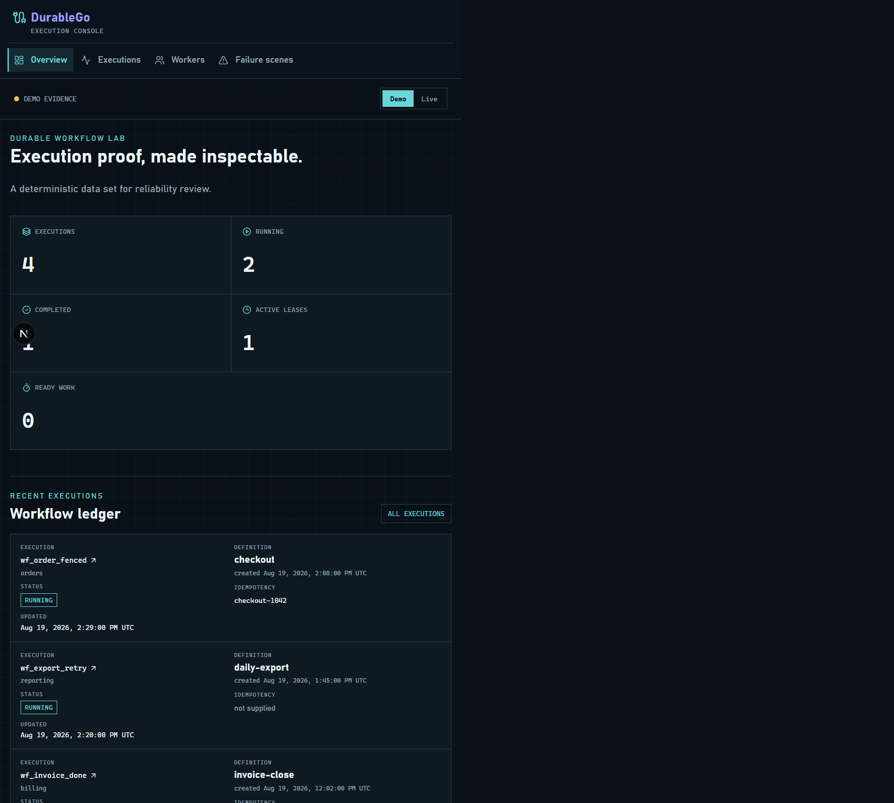
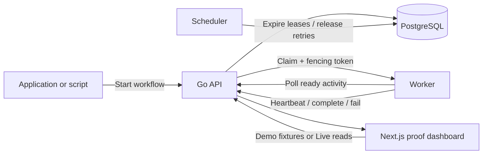

# DurableGo

DurableGo is a small, inspectable durable-workflow engine written in Go. It is
for learning and demonstrating what happens when background work is retried,
workers crash, or an old worker resumes after its lease has been reclaimed.

It is deliberately not a Temporal replacement. Instead, it focuses on a
compact set of guarantees that a reviewer can trace from PostgreSQL state and
ordered events through the API into a read-only operations dashboard.



## What It Does

An application starts a workflow made of dependency-aware activities. DurableGo
persists that workflow, leases ready activities to workers, records every state
transition, and uses fencing tokens to stop an older worker from overwriting a
newer claim. The scheduler returns abandoned or retry-pending work to the ready
queue.



## Why The Leases Matter

Activities are **at least once**, not exactly once. A side effect can be
attempted again after a crash, so applications must supply their own idempotency
key for an external charge, email, or write. DurableGo's job is to make the
engine-side state transition safe and explainable.

```mermaid
sequenceDiagram
  participant A as Worker A
  participant S as Scheduler
  participant B as Worker B
  participant E as DurableGo engine

  A->>E: Claim activity (token 1)
  Note over A: Crashes or loses its lease
  S->>E: Lease expires; activity becomes ready
  B->>E: Claim activity (token 2)
  A->>E: Complete activity (token 1)
  E-->>A: Reject stale completion
  Note over E: Token 2 remains authoritative
```

## Guarantees

- Workflow state, activity leases, idempotency keys, and event history have a
  PostgreSQL persistence contract.
- Activities execute at least once; external side effects need application-level
  idempotency.
- Reusing a namespace and idempotency key returns the original workflow instead
  of creating a duplicate.
- A claim includes a lease owner and monotonically increasing fencing token.
- Stale heartbeats, completions, and failures are rejected after a newer claim.
- The dashboard distinguishes deterministic Demo evidence from an unavailable,
  empty, partial, or populated Live API response.

## Inspect The Proof

The dashboard is a read-only execution console rather than a workflow control
panel. In Demo mode it provides deterministic examples for completed, running,
retrying, fenced, and failed executions. In Live mode it displays only current
Go API reads and never replaces an unavailable response with fixture data.

Use it to inspect:

- Execution totals, ready work, active leases, and a stale-completion sequence.
- Workflow namespace, definition, idempotency key, lifecycle timestamps, and
  status.
- Activity dependencies, attempts, retry schedule, lease owner, fencing token,
  expiry, error, and ordered event history.
- Derived worker ownership observed from the newest workflow details.
- Failure scenes for crash recovery, stale fencing, duplicate starts, and retry
  exhaustion.

## Run Locally

```bash
docker compose up
```

API:

```bash
curl -X POST http://localhost:8080/v1/workflows \
  -H "content-type: application/json" \
  -d '{"namespace":"production","name":"order-processing","idempotency_key":"order-129331","activities":[{"name":"validate","task_queue":"default"},{"name":"payment","task_queue":"default","depends_on":["validate"]}]}'
```

Windows helper:

```powershell
.\scripts\start-order-workflow.ps1
```

## Deployment

DurableGo is packaged for Railway (API, scheduler, and independently identified
workers) with the read-only dashboard deployed to Vercel. See
[docs/deployment.md](docs/deployment.md) for the service topology, required
environment variables, verification steps, and current hosting prerequisite.

Tests:

```bash
go test ./...
go test -race ./...
```

Dashboard validation:

```bash
cd web
pnpm build
pnpm test:browser
```

The dashboard defaults to deterministic `Demo` evidence. Select `Live` to read
the configured `DURABLEGO_API_URL`; unavailable or empty live results remain
explicit and are never replaced with fixture data.

If Go is not installed locally, run:

```bash
docker run --rm -v "$PWD:/src" -w /src golang:1.23 go test ./...
```

## Proof Scenes

### Stale Worker Fencing

1. Worker A claims an activity and receives fencing token 1.
2. Worker A freezes past its lease.
3. The scheduler marks the activity ready again.
4. Worker B claims the same activity with fencing token 2.
5. Worker A resumes and tries to complete with token 1.

Invariant: Worker A's stale completion is rejected and cannot overwrite Worker B's outcome.

### Duplicate Workflow Start

1. A client starts a workflow with namespace `production` and idempotency key `order-129331`.
2. The client repeats the same request after a simulated network timeout.

Invariant: the API returns the original workflow execution instead of creating a duplicate.

### Retry Exhaustion

1. A worker claims an activity.
2. The handler reports retryable failure until attempts are exhausted.

Invariant: activity and workflow move to failed state and event history records the terminal transition.

## Roadmap

- Wire the execution services to PostgreSQL repositories.
- Add gRPC/protobuf worker transport in parallel with the REST worker API.
- Expand DAG execution demos with parallel payment and inventory branches.
- Add OpenTelemetry spans and a local Prometheus/Grafana stack.
- Record benchmark artifacts for 1, 2, 4, and 8 worker runs.
- Add hosted demo deployment with API-key protection for mutating endpoints.
