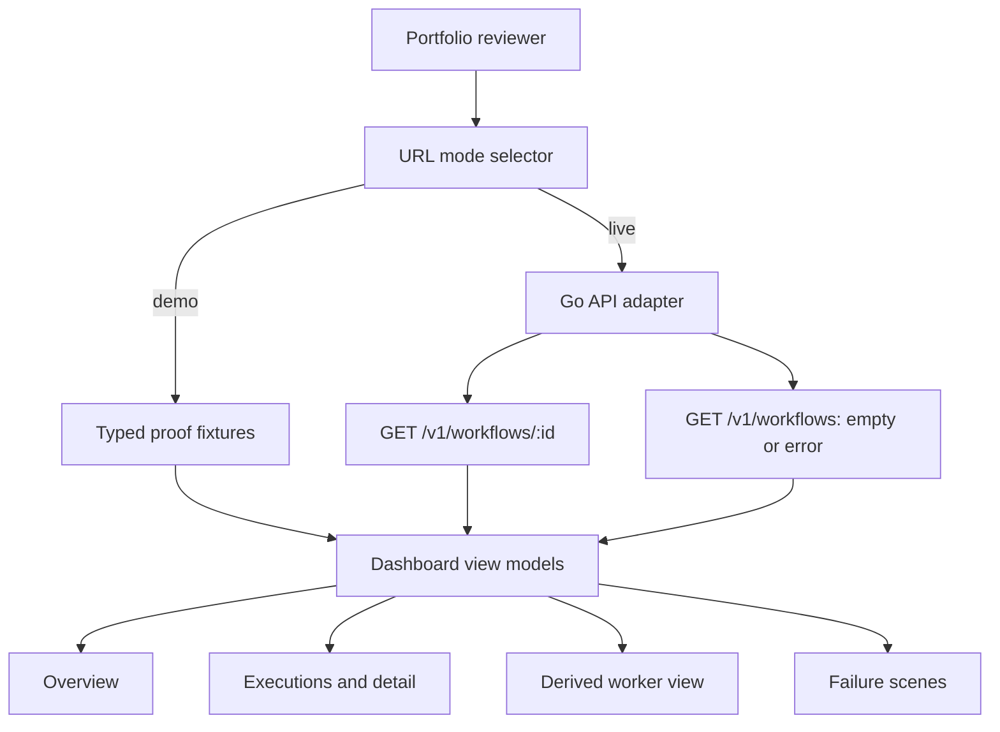

# feat: Build DurableGo proof dashboard

## Summary

Replace DurableGo's single-page dashboard shell with a complete Next.js control
plane. The dashboard will make workflow execution, lease ownership, fencing,
retries, and failure evidence inspectable before the Oracle-hosted deployment
exists, while retaining an honest live-data mode for the current Go API.

---

## Problem Frame

DurableGo already proves durable state transitions in Go and PostgreSQL, but its
dashboard only lists aggregate workflow counts and static proof-scene copy. A
portfolio reviewer cannot inspect an execution, observe a lease or fencing token,
or distinguish seeded proof data from a live engine response.

The frontend needs to act as a read-only execution console. It must show
deterministic, realistic evidence in Demo mode and expose actual API state,
including empty and unavailable states, in Live mode.

---

## Requirements

**Data Modes**

- R1. Every dashboard route exposes a persistent `Demo` / `Live` mode control.
  Demo is the default when the URL omits mode and uses a clearly labeled
  deterministic dataset. Internal links preserve the selected mode.
- R2. Live mode fetches only current read endpoints from the Go API. It never
  substitutes demo records when a live request fails or returns no executions.
  The list contract distinguishes a successful empty list from an unavailable
  backend response.
- R3. Live data loading is bounded to the recent workflow set when deriving
  fleet state from workflow details. The view resolves the newest 20 workflows,
  ordered by `CreatedAt` descending and `ID` as a tie-breaker.

**Execution Inspection**

- R4. The overview shows execution totals, recent workflows, active leases,
  ready work, and a concise stale-write proof sequence.
- R5. An executions route lists workflows with status, namespace, definition,
  idempotency key presence, and lifecycle timestamps.
- R6. A workflow detail route shows activity dependencies, attempts, retry
  state, lease owner, fencing token, lease expiry, last error, and ordered
  execution events.
- R7. A workers route derives currently visible lease owners from workflow
  activity data and marks the result as a derived view rather than a worker
  registry.

**Portfolio Proofs and Quality**

- R8. A failure-scenes route explains crash recovery, stale completion fencing,
  duplicate workflow starts, and retry exhaustion using the same event and
  activity vocabulary as the engine.
- R9. The dashboard remains responsive, keyboard-navigable, and legible at
  mobile and desktop widths. Dynamic status changes use non-color labels and
  accessible announcements.
- R10. Browser coverage verifies mode selection, execution inspection, and
  honest Live-mode unavailable state; the existing production build remains
  green.

---

## Key Technical Decisions

- KTD1. **Use URL-backed mode selection:** `mode=demo|live` makes the chosen
  data source linkable, reload-safe, and visible to a reviewer without adding a
  client-side state store.
- KTD2. **Keep demo data in a typed adapter, not page-local literals:** pages
  receive one dashboard view model regardless of source, while the mode banner
  preserves provenance.
- KTD3. **Correct the Go workflow-list error contract before building Live
  mode:** `GET /v1/workflows` returns an empty array for a successful empty
  result and a non-2xx error for persistence failures. This is the only backend
  behavior change in the slice.
- KTD4. **Treat Live workers as a bounded observation, not a registry:** the
  Workers page derives owners from the newest 20 workflow details and labels the
  timestamp, observation window, and any incomplete detail reads.
- KTD5. **Use a static accessible activity graph with a canonical detail list:**
  the list owns keyboard reading and all activity fields; the graph is a visual
  summary with no node selection, pan, or zoom contract.
- KTD6. **Define loading and recovery state at the route boundary:** Live pages
  render skeletons while loading, retain successful sections when optional
  derived data fails, and provide a reload action that preserves URL mode.
- KTD7. **Use server components for data reads and small client islands for
  interaction only:** this follows the existing `web/app/page.tsx` fetch model
  and keeps API URLs and failures server-side.
- KTD8. **Add Playwright as the browser contract harness:** the web package has
  no existing test runner, and route, mode, accessibility, and error-state
  behavior require browser-level verification.

---

## High-Level Technical Design

Live mode first reads the workflow list, then resolves the newest 20 details
when a page needs activity, lease, or event data. Demo mode supplies the same
view-model shape. A list failure makes the route unavailable; an individual
detail failure leaves successful records visible and annotates only the affected
derived section. A Live failure never crosses into the fixture path.

---

## Scope Boundaries

### Deferred for Later

- Mutating workflow controls, such as start, cancel, retry, or worker control.
- A persistent worker registry and scheduler-health endpoint in the Go API.
- Real-time subscriptions, charts backed by time-series storage, and role-based
  access control.
- RelayDB dashboard expansion beyond its current operations console.

### Outside This Frontend Slice

- Changing DurableGo execution semantics, persistence, scheduler behavior, or
  API authentication beyond the workflow-list error contract in KTD3.
- Presenting demo values as live service telemetry.

---

## System-Wide Impact

- The dashboard becomes an explicit public proof surface, so fixture content
  must use real engine status names and event vocabulary.
- The Go API's exported JSON field casing, duration values, and zero timestamps
  are external contracts to normalize at the frontend adapter boundary, not
  throughout route components.
- Live mode performs a bounded fan-out of 20 detail reads because current list
  responses do not carry activity or lease data; the derived Workers page is an
  observation window, never a complete fleet report.

---

## Risks and Dependencies

| Risk | Mitigation |
|---|---|
| Live workflow lists grow beyond a demo-sized set | Derive fleet state only from the newest bounded workflows and disclose it in the UI. |
| Go JSON field names differ from conventional frontend casing | Normalize Go response DTOs in one adapter and cover mapping in browser scenarios. |
| No frontend test runner exists | Add Playwright configuration and run it alongside the existing Next.js production build. |
| Oracle deployment is pending | Demo mode keeps the proof surface usable locally and on a future static preview without claiming live state. |

---

## Implementation Units

### U1. Establish Honest Live Data and Typed Dashboard Sources

- **Goal:** Define stable dashboard types, typed proof fixtures, and a URL-aware
  data adapter that selects Demo or Live state without leaking Go DTO shapes into
  page components.
- **Requirements:** R1, R2, R3, R10.
- **Dependencies:** None.
- **Files:**
  - Modify `internal/api/server.go`
  - Modify `internal/api/server_test.go`
  - Modify `internal/execution/engine.go`
  - Modify `internal/persistence/postgres.go`
  - Create `web/lib/dashboard-types.ts`
  - Create `web/lib/demo-data.ts`
  - Create `web/lib/dashboard-data.ts`
  - Modify `web/lib/api.ts`
  - Modify `web/package.json`
  - Create `web/playwright.config.ts`
- **Approach:** Change the Go backend list interface to propagate persistence
  errors to the HTTP handler while preserving an explicit empty JSON array for a
  successful zero-row result. Model workflow, activity, event, lease, and
  derived-worker display data in frontend casing. Parse `mode` from route search
  parameters. Demo mode returns deterministic records covering all proof scenes.
  Live mode adapts `GET /v1/workflows` and detail responses into discriminated
  populated, empty, unavailable, or partial-derived states. Normalize Go
  duration nanoseconds and zero timestamps into display-safe nullable values.
- **Patterns to follow:** `web/lib/api.ts` for server-side uncached reads;
  `internal/api/server.go` and `internal/execution/engine.go` for the current
  HTTP payloads and status/event vocabulary.
- **Test scenarios:**
  - `GET /v1/workflows` returns `[]` when persistence has no executions and a
    non-2xx response when its backend list operation fails.
  - Adapted live workflow, activity, and event fields retain status, token, and
    lease-expiry values from the API response.
  - Duration nanoseconds and zero or absent timestamps normalize into correct
    retry, lease, and not-applicable display states.
- **Test expectation:** Route-level browser scenarios that exercise these data
  sources are added with U2 and U3 after the shared shell and overview exist.
- **Verification:** Pages consume one dashboard model per mode; no route embeds
  ad hoc proof records or silently changes a Live response into Demo state.

### U2. Build the Shared Control-Plane Shell and Route States

- **Goal:** Replace the single-page layout with responsive navigation, data-mode
  control, source labeling, shared status badges, and dense operations styling.
- **Requirements:** R1, R9.
- **Dependencies:** U1.
- **Files:**
  - Modify `web/app/layout.tsx`
  - Modify `web/app/styles.css`
  - Create `web/components/dashboard-shell.tsx`
  - Create `web/components/mode-toggle.tsx`
  - Create `web/components/status-badge.tsx`
  - Create `web/components/empty-state.tsx`
  - Create `web/app/loading.tsx`
  - Create `web/app/error.tsx`
  - Create `web/tests/dashboard.spec.ts`
- **Approach:** Use a desktop sidebar that becomes a compact, scrollable mobile
  navigation row. Keep route-level layout dimensions stable. Present the
  `Demo`/`Live` selector as a segmented URL control and expose the active source
  near the page title so evidence provenance is visible at all times. Navigation
  order is Overview, Executions, Workers, then Failure scenes. Preserve mode on
  every internal navigation target. Add landmarks, a skip link, clear page
  headings, non-color status text, and focus-safe route/error transitions.
- **Patterns to follow:** `relaydb/dashboard/components/operations-sidebar.tsx`
  for responsive operations navigation and `relaydb/dashboard/app/globals.css`
  for the nearby console visual language.
- **Test scenarios:**
  - Each primary destination is reachable by keyboard from shared navigation.
  - The active route and selected data mode are visually and semantically
    identifiable.
  - Missing mode defaults to Demo, and navigation plus direct reload preserve
    the selected URL mode.
  - Loading, unavailable, and reload states announce their status without
    relying on color alone.
  - Mobile viewport navigation does not overflow or hide the mode selector.
- **Verification:** All dashboard routes use the same shell and remain readable
  at desktop and mobile viewport sizes.

### U3. Implement Overview and Execution Browsing

- **Goal:** Build the overview and execution-list surfaces that turn current
  workflow records into a scan-friendly execution ledger.
- **Requirements:** R4, R5, R9.
- **Dependencies:** U1, U2.
- **Files:**
  - Modify `web/app/page.tsx`
  - Create `web/app/workflows/page.tsx`
  - Create `web/components/metric-grid.tsx`
  - Create `web/components/workflow-table.tsx`
  - Create `web/components/proof-timeline.tsx`
  - Create `web/app/workflows/loading.tsx`
  - Create `web/app/workflows/error.tsx`
  - Modify `web/tests/dashboard.spec.ts`
- **Approach:** Render server-fetched view models as a metrics strip, recent
  execution ledger, and a concise stale-fencing event sequence. The metrics
  strip shows workflow totals, active leases, and ready work. The execution
  list surfaces lifecycle timestamps, namespace, definition, idempotency-key
  presence, and status, with links to execution detail. On narrow screens, turn
  dense rows into labeled stacked records rather than truncating identifiers.
- **Patterns to follow:** `relaydb/dashboard/components/metric-strip.tsx` and
  `relaydb/dashboard/components/event-table.tsx` for dense metric and table
  treatment; `web/app/page.tsx` for server-component page reads.
- **Test scenarios:**
  - Demo overview renders running, completed, failed, active-lease, and
    ready-work totals.
  - Execution rows show a workflow's status and navigate to its detail route.
  - Empty Live workflow list renders an honest empty state rather than fixture
    records.
  - Unavailable Live requests render an error state while navigation remains
    usable.
  - A mode-preserving reload action retries an unavailable Live list request.
- **Verification:** A reviewer can identify the current source, scan executions,
  and open a workflow without reading raw JSON.

### U4. Implement Workflow Detail and Derived Workers View

- **Goal:** Make workflow state transitions and current lease ownership
  inspectable at the level needed to prove fencing and recovery behavior.
- **Requirements:** R6, R7, R9.
- **Dependencies:** U1, U2, U3.
- **Files:**
  - Create `web/app/workflows/[id]/page.tsx`
  - Create `web/app/workers/page.tsx`
  - Create `web/components/activity-graph.tsx`
  - Create `web/components/activity-list.tsx`
  - Create `web/components/event-timeline.tsx`
  - Create `web/components/worker-table.tsx`
  - Create `web/app/workflows/[id]/loading.tsx`
  - Create `web/app/workflows/[id]/error.tsx`
  - Create `web/app/workflows/[id]/not-found.tsx`
  - Modify `web/tests/dashboard.spec.ts`
- **Approach:** Use an accessible dependency graph plus a detail list so a
  reader can inspect both the execution shape and exact activity fields. Render
  attempts, retry schedule, lease owner, fencing token, expiry, and last error
  where applicable. Render a static graph as a visual complement to the
  accessible activity list. Aggregate owners from the newest 20 detail records
  for the Workers route and label the observation timestamp, bound, and any
  detail-read omissions in Live mode.
- **Patterns to follow:** `internal/execution/engine.go` for activity transition
  names and event sequence; `internal/persistence/postgres.go` for lease and
  retry semantics.
- **Test scenarios:**
  - A running activity shows its owner, fencing token, and expiry.
  - A retry-pending activity shows attempt progression, next attempt, and error.
  - A stale-completion event remains visible in the timeline after a newer
    claim.
  - The Workers page distinguishes active owners from an empty derived result.
  - A partially failed detail fan-out keeps successful owners visible and marks
    the observation as incomplete.
  - Unknown workflow IDs render not-found behavior without breaking navigation.
  - Activity, event, lease, retry, and error sections each distinguish
    unavailable data from normal not-applicable or empty values.
- **Verification:** The UI exposes every read field necessary to explain why a
  stale worker cannot overwrite newer work.

### U5. Implement Failure Scenes and Portfolio Readiness Checks

- **Goal:** Package the engine's test-backed reliability claims as readable,
  linked dashboard scenes and verify the frontend's production behavior.
- **Requirements:** R8, R9, R10.
- **Dependencies:** U1, U2, U4.
- **Files:**
  - Create `web/app/failure-scenes/page.tsx`
  - Create `web/components/failure-scene-card.tsx`
  - Modify `web/tests/dashboard.spec.ts`
  - Modify `web/package.json`
  - Modify `web/pnpm-lock.yaml`
  - Modify `.github/workflows/ci.yml`
  - Modify `README.md`
- **Approach:** Render four fixed explanatory scenes from the typed proof
  dataset. Each scene names the failure window, the durable invariant, the
  expected event sequence, and the dashboard surface that demonstrates it.
  Demo scenes link to matching fixtures; Live scenes stay explanatory until
  matching live evidence exists. Keep scenes read-only. Add the Playwright
  package, a browser-test script, a configured Next server lifecycle, required
  browser installation in CI, and browser-suite execution alongside the existing
  production build.
- **Patterns to follow:** `README.md` Proof Scenes section and
  `tests/failure/` scenarios for the authoritative reliability claims;
  `.github/workflows/ci.yml` for the current dashboard build job.
- **Test scenarios:**
  - Each scene renders its invariant and links to a representative execution.
  - Stale fencing scene contains both token generations and rejection event.
  - Retry exhaustion scene ends with terminal workflow failure.
  - Live failure scenes never link to demo executions or present fixture events
    as current engine evidence.
  - The production build and browser suite pass using only Demo mode data.
- **Verification:** A portfolio reviewer can enter from the overview, choose a
  proof scene, and inspect the supporting execution state without a deployed Go
  backend.

---

## Deferred Implementation Notes

- Choose the exact activity-graph rendering technique during implementation;
  it must preserve a readable list/table alternative for narrow screens.
- Confirm the preferred Playwright server lifecycle against the installed pnpm
  version when adding the test command.
- Revisit bounded live fan-out if a future API adds pagination, workflow
  summaries, or worker registration.